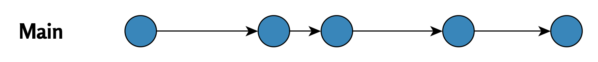

# Yksi Git-haara vaiko monta?{#one-or-many-brances}

  

<figcaption style="font-size: 0.9em; color: gray; margin-top: 5px;">
    Image credit: <a href="https://www.pexels.com/photo/snow-covered-trees-and-road-6551867/" target="_blank">Pexels</a>
</figcaption>
  
 

Git-työskentelytavat eroavat merkittävästi ohjelmistokehityksessä ja akateemisessa tutkimuksessa, mikä johtuu kunkin projektityypin tavoitteista ja ryhmän rakenteesta. Tässä luvussa tarkastelemme näitä eroja ja niiden vaikutuksia haarojen hallintaan.

## Git ohjelmistokehityksessä

Ohjelmistokehityksessä (esim. tietokonepelien ohjelmoinnissa) työryhmät hyödyntävät usein useita Git-haaroja samanaikaisesti.

Tyypillinen työnkulku sisältää:

-   **Päähaaran** (`main` tai `master`), joka sisältää tuotantoversion.
-   **Useita muita haaroja**, joissa yksittäiset ominaisuudet kehitetään ja testataan erikseen.

Yhdistämiset päähaaraan tehdään vasta, kun ominaisuudet ovat valmiita. Tämä rakenne mahdollistaa rinnakkaisen kehityksen, minimoi konflikteja ja varmistaa, että päähaara pysyy vakaana.

Alla näkyvä virtauskaavio kuvaa tätä toimintatapaa:

 

 

## Git academiassa

Akateemisessa tutkimuksessa työryhmät käyttävät usein pelkkää yhtä **Git-päähaaraa**.

Syitä tälle:

-   Yhteistyö tapahtuu usein yhden tai muutaman yhteisen tiedoston (esim. artikkelin) parissa.
-   Haarojen käyttö voisi olla monimutkaista pienemmissä tiimeissä tai epämuodollisessa ympäristössä.

Tätä työnkulun rakennetta kuvastaa seuraava kaavio:

 

  

Tämä lähestymistapa tekee työnjaosta yksinkertaista, mutta lisää riskiä haarojen divergenssistä, jos useat jäsenet muokkaavat samaa tiedostoa samanaikaisesti.

## Yhteenveto

Ohjelmistokehityksen ja akateemisten projektien erot Git-työskentelyssä heijastavat kummankin alan prioriteetteja. Ohjelmistokehityksessä korostetaan stabiliteettia ja rinnakkaista kehitystä, kun taas akateemisissa projekteissa yksinkertaisuus ja yhteinen työskentely päähaarassa ovat etusijalla.

 

 

------------------------------------------------------------------------

Divergent Git branches - ongelmasta ratkaisuun © 2025 by Ville Langén is licensed under the [CC BY-SA 4.0](https://creativecommons.org/licenses/by-sa/4.0/?ref=chooser-v1).

