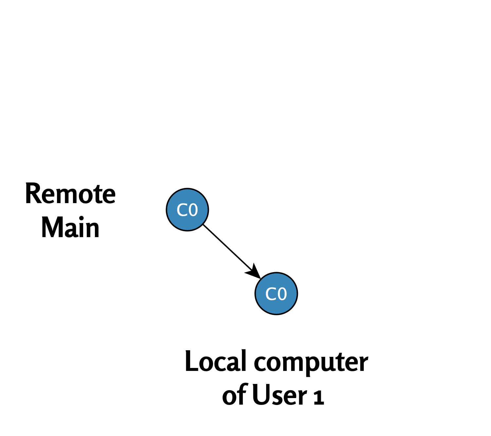
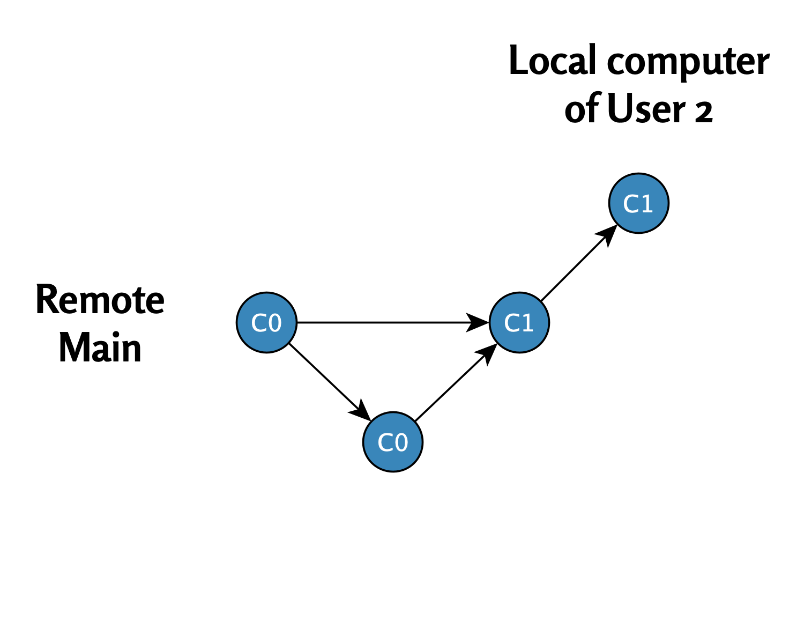

# Ei Git-haaraongelmia{#no-divergences}

  

<figcaption style="font-size: 0.9em; color: gray; margin-top: 5px;">
    Image credit: <a href="https://www.pexels.com/photo/cheerful-multiethnic-students-having-high-five-with-teacher-5940841/" target="_blank">Pexels</a>
</figcaption>
  

Tässä luvussa käsittelemme tilannetta, jossa kaksi tai useampi käyttäjä työskentelee päähaarassa ilman eri päivitysten välisiä divergenssi-ristiriitoja. Esittelen yksinkertaisen työnkulun, jossa käyttäjät tekevät omat muutoksensa ja päivityksensä ilman, että tilanne eskaloituu haaraongelmiksi. 

Tämä on tyypillinen tilanne, kun jokainen muistaa tehdä pull-komennon ennen omia muokkauksiaan, jolloin päähaara pysyy vakaana.

## Vakaa päähaara

\

**Tilanne: Remote Main (C0)**

\

Työ alkaa etähakemistossa olevasta päähaarasta, jossa viimeisin tilanne on commit `C0`.\
Etähakemistoa kuvaa seuraava kaavio:

{width="468"}\

------------------------------------------------------------------------

\

\

**Käyttäjä 1: Pull (C0)**

\

**Pull**: Käyttäjä 1 lataa uusimmat tiedot etähakemistosta (`C0`) paikalliseen hakemistoonsa.

{width="450"}\

------------------------------------------------------------------------

\

\

**Käyttäjä 1: muokkaus ja push (C1)**

\

1.  **Muokkaus**: Käyttäjä 1 muokkaa tiedostoja ja tekee commitin `C1`.
2.  **Push**: Muutokset päivitetään takaisin etähakemistoon.

Tilanne etähakemistossa commitin `C1` jälkeen:

{width="450"}

\

------------------------------------------------------------------------

\

\

**Käyttäjä 2: Pull (C1)**

\

**Pull**: Käyttäjä 2 lataa commitin `C1` paikalliseen hakemistoonsa.

 

{width="518"}

\

------------------------------------------------------------------------

\

\

**Käyttäjä 2: muokkaus ja push (C2)**

\

1.  **Muokkaus**: Käyttäjä 2 muokkaa tiedostoja ja tekee commitin `C2`.
2.  **Push**: Muutokset päivitetään takaisin etähakemistoon.

Tilanne etähakemistossa commitin `C2` jälkeen:

\

\

{width="516"}

\

------------------------------------------------------------------------

\

## Yhteenveto

Tässä yksinkertaisessa esimerkissä molemmat käyttäjät työskentelivät päähaarassa ilman ristiriitoja. Jokainen vaihe seuraa loogisesti toistaan: pull → muokkaus → commit → push.

Seuraavassa luvussa tarkastelemme tilannetta, jossa molemmat käyttäjät muokkaavat commitia `C0` samanaikaisesti. Tämä voi johtaa divergent-haaroihin ja konfliktien ratkaisuun.

\

\

------------------------------------------------------------------------

Divergent Git branches - ongelmasta ratkaisuun © 2025 by Ville Langén is licensed under the [CC BY-SA 4.0](https://creativecommons.org/licenses/by-sa/4.0/?ref=chooser-v1).

