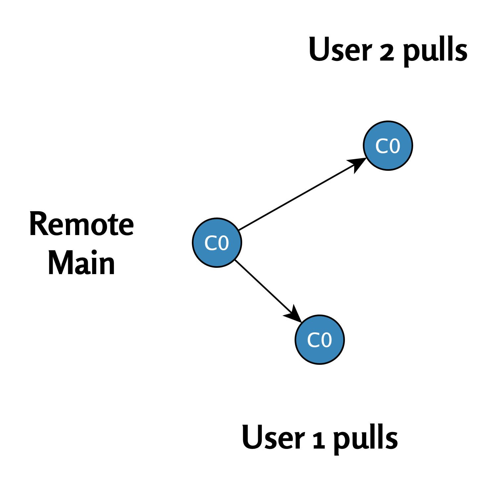
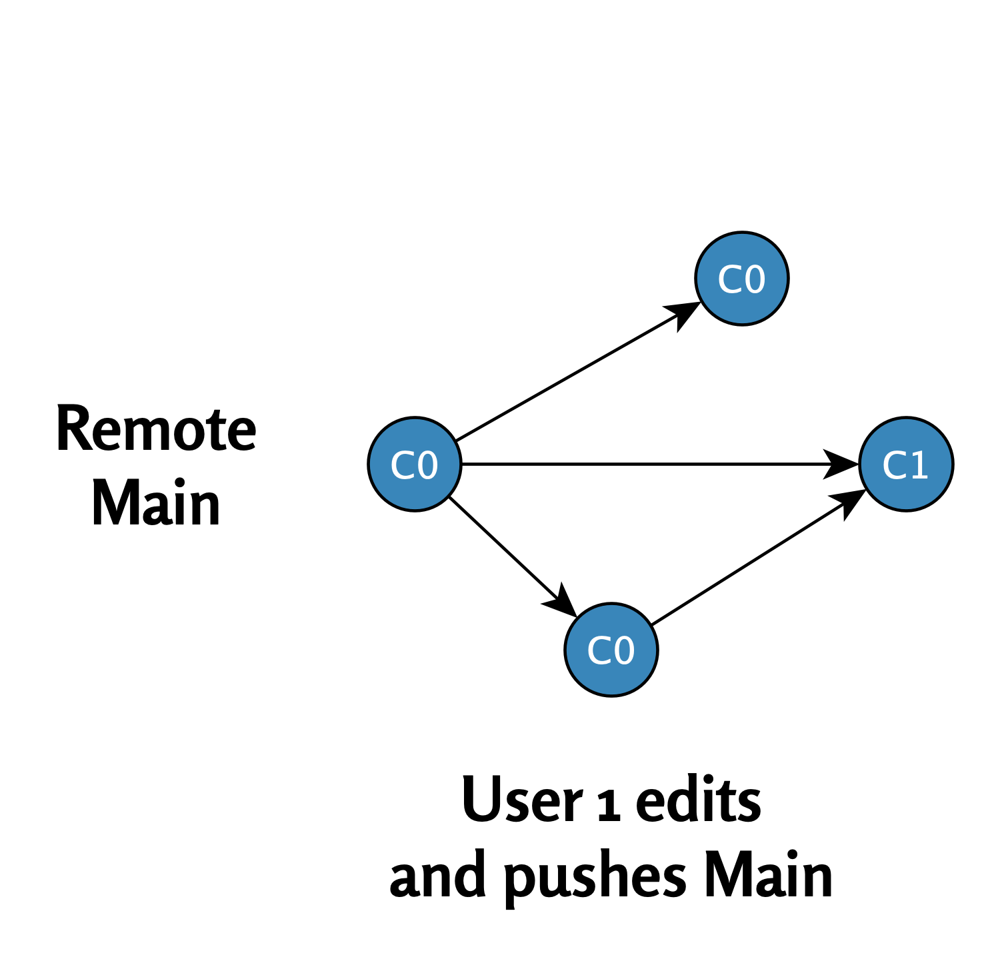

# Haarojen divergenssi{#divergences}

  

<figcaption style="font-size: 0.9em; color: gray; margin-top: 5px;">
    Image credit: <a href="https://www.pexels.com/photo/a-woman-crying-for-help-7640773/" target="_blank">Pexels</a>
</figcaption>
  

Edellisessä luvussa tarkastelimme tilannetta, jossa kaksi käyttäjää työskenteli päähaarassa ilman ongelmia. Tässä luvussa näemme, mitä tapahtuu, kun kaksi käyttäjää samanaikaisesti tekee muutoksia samaan commit-tilanteeseen `C0` ja yrittää työntää omat commitinsa etähakemistoon.

\

## Haaraongelman synty

**Vaihe 1: Käyttäjä 1 ja käyttäjä 2 tekevät pull-komennon (C0)**

\

Molemmat käyttäjät aloittavat projektin samasta lähtötilanteesta. He tekevät **pull-komennon** ja päivittävät paikalliset hakemistonsa commit-tilaan `C0`.

Tilanne näytetään tässä kaaviossa:

{width="410"}

\

**Vaihe 2: Käyttäjä 1:n muokkaukset hyväksytään etähakemistoon**

\

-   **Käyttäjä 1** muokkaa tiedostoa ja tekee commitin `C1`.
-   **Käyttäjä 1** suorittaa push-komennon, ja commit `C1` hyväksytään etähakemistoon, koska se perustuu suoraan tilaan `C0`.

{width="415"}

\

**Vaihe 3: Käyttäjän 2:n muokkauksia ei hyväksytä etähakemistoon**

\

1.  **Käyttäjä 2** muokkaa toista osaa tiedostosta ja tekee commitin `C2`.
2.  **Käyttäjä 2** yrittää suorittaa push-komennon, mutta Git estää tämän, koska etähakemistossa oleva päähaara on edennyt commit-tilaan `C1`. Käyttäjän 2 paikallinen commit `C2` on nyt ristiriidassa etähakemiston tilan kanssa.

{width="451"}

\

## Yhteenveto

\

Kun kaksi käyttäjää yrittää tehdä muutoksia samanaikaisesti ja työntää niitä etähakemistoon, syntyy **haarojen divergenssi**. Tämä tarkoittaa, että etähakemiston ja paikallisten haarojen välillä on ristiriita, joka vaatii käyttäjältä lisätoimenpiteitä (kuten yhdistämistä tai uudelleenpohjustusta) ongelman ratkaisemiseksi.

\

Seuraavassa luvussa käsittelemme, kuinka näitä ristiriitoja voidaan ratkaista eri tavoilla.

\

\

------------------------------------------------------------------------

Divergent Git branches - ongelmasta ratkaisuun © 2025 by
Ville Langén is licensed under the [CC BY-SA
4.0](https://creativecommons.org/licenses/by-sa/4.0/?ref=chooser-v1).

