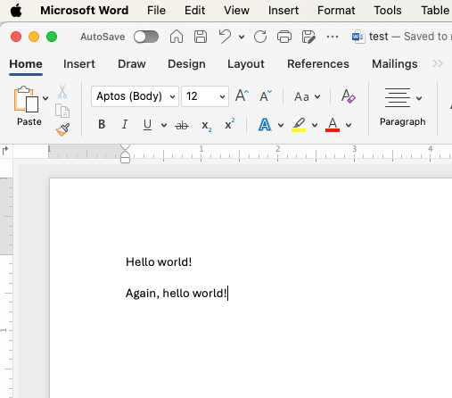

# Korjausmetodi 1: *merge*-toiminto{#method-one}


<br><br>

<figcaption style="font-size: 0.9em; color: gray; margin-top: 5px;">
    Image credit: <a href="https://www.pexels.com/photo/abstract-background-of-painting-with-curved-dye-flows-6404219/" target="_blank">Pexels</a>
</figcaption>
<br><br>

Edellisessä luvussa tarkastelimme tilannetta, jossa kaksi käyttäjää samanaikaisesti teki muutoksia samaan commit-tilanteeseen `C0` ja yritti työntää omat commitinsa etähakemistoon. Tässä luvussa näemme, mitä tapahtuu, kun käyttäjä asettaa Gitin konfiguraatiot siten, että pull-komento pyrkii automaattisesti yhdistämään (merge) muutokset.

Tarkastelemme tilanteen etenemistä etenkin Käyttäjän 2 näkökulmasta.

\

\

------------------------------------------------------------------------

\

## Pull ilman `merge`-lupaa{#pull-without-merge}

**Vaihe 1: Käyttäjä 1 ja Käyttäjä 2 tekevät pull-komennon (C0)**

\

Molemmat käyttäjät aloittavat projektin samasta lähtötilanteesta. He tekevät **pull-komennon** ja päivittävät paikalliset hakemistonsa commit-tilaan `C0`.

Tämän jälkeen he aloittavat tiedoston `test.R` työstämisen. Se näyttää pisteessä `C0` kaikille käyttäjille tältä:

\

\

(ref:alkutilanne) Alkutilanne commit-pisteessä C0.

```{r alkutilanne, fig.show='hold', echo=FALSE, out.width='50%', fig.margin = TRUE}

knitr::include_graphics("images/SCR-20250110-udus.png")

```

**Kuva**. Alkutilanne commit-pisteessä C0.

\

\

------------------------------------------------------------------------

\

**Vaihe 2: Käyttäjät 1 ja 2 muokkaavat tiedostoa kukin tahollaan**

\

- Käyttäjä 1 on muokannut tiedostoa ja **työntänyt jo sen etähakemistoon**.
- Käyttäjä 2 niin ikään on muokannut tiedostoa, mutta ei ole vielä työntänyt sitä etähakemistoon.

\

(ref:testfile) Käyttäjä 1:n tekemät muutokset jo etähakemistossa (vasen kuva), Käyttäjä 2:n tekemiä muutoksia ei ole vielä pushattu (oikealla). Muutokset poikkeavat toisistaan selvästi.

```{r testfile, fig.show='hold', echo=FALSE, out.width=c('44%','10%','44%'), fig.margin = TRUE}

knitr::include_graphics("images/SCR-20250110-uehj.png")
knitr::include_graphics("images/empty_panel_space.png")
knitr::include_graphics("images/SCR-20250110-uejf.png")

```

**Kuva**. Käyttäjä 1:n tekemät muutokset jo etähakemistossa (vasen kuva), Käyttäjä 2:n tekemiä muutoksia ei ole vielä pushattu (oikealla). ***Käyttäjien tekemät muutokset poikkeavat toisistaan selvästi.***

\

\

------------------------------------------------------------------------

\

**Vaihe 3: Käyttäjä 2 yrittää pushata tekemiään muokkauksia etähakemistoon**\

\

- Käyttäjä 2 yrittää ensin tehdä pull-komentoa, mutta tämä epäonnistuu:

\


**Video**. Ensimmäinen - ja epäonnistunut - pull-yritys.

\

\

- Käyttäjä 2 yrittää tehdä commit + push -komentoa, mutta myös tämä epäonnistuu:

\


**Video**. Myös commit + push epäonnistuu.

\

\

- Käyttäjä 2 tekee uudelleen pull-komennon ja saa seuraavan virheilmoituksen ohjeineen:

\

\

**Video**. Uusi - epäonnistunut - pull-yritys.

\

\

- Käyttäjä 2 kopioi leikepöydälle Gitin antamasta ohjeesta seuraavan komennon:

\

`git config pull.rebase false`

\


**Video**. Pull-yrityksestä leikepöydälle kopioitava käsky.

\

\

## `merge`-luvan antaminen

Ennen kuin Käyttäjä 2 tekee kolmannen pull-yrityksen, hän ajaa Terminalissa komennon

\

```{bash, eval = FALSE}
git config pull.rebase false
```

\

antaakseen Gitille luvan yrittää merge-toimintoa, kun uusia muutoksia vedetään etähakemistosta.

Komennon ajaminen Terminalissa tapahtuu seuraavasti:

\

\

```{r rebase_false, echo=FALSE}

knitr::include_graphics("images/Jan-10-2025-23-34-59.mp4")

```

**Video**. Komennon `git config pull.rebase false` ajaminen Terminalissa.

\

\


## Pull merge-luvalla

Nyt Käyttäjä 2 voi onnistuneesti tehdä pull-komennon, joka luo uuden yhdistämiscommitin. Se kuitenkin tuottaa varoituksen, joka käskee varmistaa, että yhdistäminen on ollut onnistunutta:

\


**Video**. Kolmas pull-yritys onnistuu.

\

\

Seuraavaksi Käyttäjä 2:n tulee varmistaa testitiedostoa `test.r` muokkaamalla, että *merge* on onnistunut.

\


**Video**. Tiedosto `test.R` tulee muokata manuaalisesti kuntoon *merge*-toiminnon jälkeen.

\

\

Tämän jälkeen commit + push -toiminnot menevät läpi ongelmitta:

\

{width="99%"}

**Video**. Commit + push -toiminnot menevät läpi etähakemistoon.

\

\

Nyt tiedosto `test.R` näkyy Käyttäjä 2:n päivittämässä muodossa GitHubissa:

\


**Video**. Mergen läpikäynyt tiedosto näkyy nyt etähakemistossa GitHubissa.

\

\

## Binaariset tiedostot

**Binaariset tiedostot** ovat tiedostoja, jotka sisältävät tietoa muodossa, jota ei voida suoraan lukea tai muokata tekstieditorilla. Esimerkkejä binaarisista tiedostoista ovat esimerkiksi Word-asiakirjat (*.docx*) ja bittikarttakuvat (esim. *.png*). Näitä tiedostoja ei voi yhdistää *merge*-toiminnolla Gitissä, koska niiden sisältöä ei voida tulkita yksinkertaisena tekstinä, ja pienetkin muutokset tiedostossa voivat aiheuttaa suuria eroja binäärisessä rakenteessa.

Vaikka asetat Gitin käyttämään `git config pull.rebase false` varmistaaksesi yksinkertaisemman vedon (`pull`), se ei auta ratkaisemaan binaaristen tiedostojen yhdistämistä. Kun kaksi käyttäjää tekee muutoksia samaan binaariseen tiedostoon eri commit-tiloissa, syntyy tilanne, jonka ratkaiseminen vaatii järeämpiä konsteja.

### Esimerkkinä *.docx*

\

**Vaihe 1: Etähakemiston tilanne (C0)**

\

Kaikki käyttäjät aloittavat tilanteesta, jossa *test.docx* on commit-tilassa `C0` ja näyttää seuraavalta:

\


\

\


**Vaihe 2. Käyttäjä 1 ja käyttäjä 2 tekevät omat muokkauksensa samaan Word-tiedostoon:**

\




**Kuva**. Käyttäjän 1 muokkaukset.

\


**Kuva**. Käyttäjän 2 muokkaukset.

\

\

**Vaihe 3: Käyttäjä 1:n muutokset hyväksytään**


\


Käyttäjä 1 ehtii tekemiensä muokkausten jälkeen ennen Käyttäjä 2:ta tehdä commitin `C1` ja push-komennon, ja commit `C1` hyväksytään etähakemistoon, koska se perustuu suoraan commit-tilaan `C0`.

\

\


**Vaihe 4: Käyttäjä 2:n muutokset hylätään**

\


1.  Käyttäjä 2 yrittää tehdä *test.docx*-tiedostoon tekemiensä muokkausten jälkeen commitin `C2`.\
2.  Git kuitenkin estää push-komennon, koska etähakemisto on siirtynyt commit-tilaan `C1`. Tämä aiheuttaa ristiriidan.

- Käyttäjä 2 ei siis pysty suorittamaan commit-, push- tai pull-komentoja.

\


**Kuva**. Käyttäjä 2 ajautuu jumiin Gitin kanssa. Commit-tilaa `C1` ei pysty hakemaan pull-komennolla, eikä commit-tilaa `C2` pysty siirtämään commit-tilan `C1` päälle.

\

Vaikka **Käyttäjä 2** antaisi komennon `git config pull.rebase false` ja yrittäisi sen jälkeen pull-toimintoa, Git ei voisi yhdistää kahta eri versiota *test.docx*-tiedostosta, koska kyseessä on binaarinen tiedosto.

\

\


## Yhteenveto

`git config pull.rebase false` on oikeastaan parhaimmillaan tilanteissa, joissa käyttäjät eivät varsinaisesti ole muokanneet samaan aikaan samaa tiedostoa, vaan ovat unohtaneet tehdä pull-komennon ennen kuin tekevät hakemistoon muokkauksia. Tällöin commit-pisteiden välisten ristiriitojen ratkaisu on Gitille melko helppoa.

`git config pull.rebase false` ei sen sijaan ole kovin tehokas ratkaisu tilanteisiin, joissa käyttäjät ovat todella muokanneet samaa tiedostoa samanaikaisesti. Tällaisissa tapauksissa syntyneet ristiriidat vaativat yleensä vähintäänkin manuaalista yhdistämisen muokkailua.

Binaaristen tiedostojen kohdalla `git config pull.rebase false` -tyyppinen muokkausten yhdistäminen ei toimi lainkaan. Koska Git ei voi yhdistää binaaristen tiedostojen sisältöä, kaikki tällaiset ristiriitatilanteet täytyy ratkaista muilla tavoilla, esimerkiksi valitsemalla jompikumpi versio tiedostosta.

Käsittelemme viimeksi mainittua seuraavassa luvussa.

\

\

------------------------------------------------------------------------

Divergent Git branches - ongelmasta ratkaisuun © 2025 by\
Ville Langén is licensed under the [CC BY-SA 4.0](https://creativecommons.org/licenses/by-sa/4.0/?ref=chooser-v1).

[](https://creativecommons.org/licenses/by-sa/4.0/)
