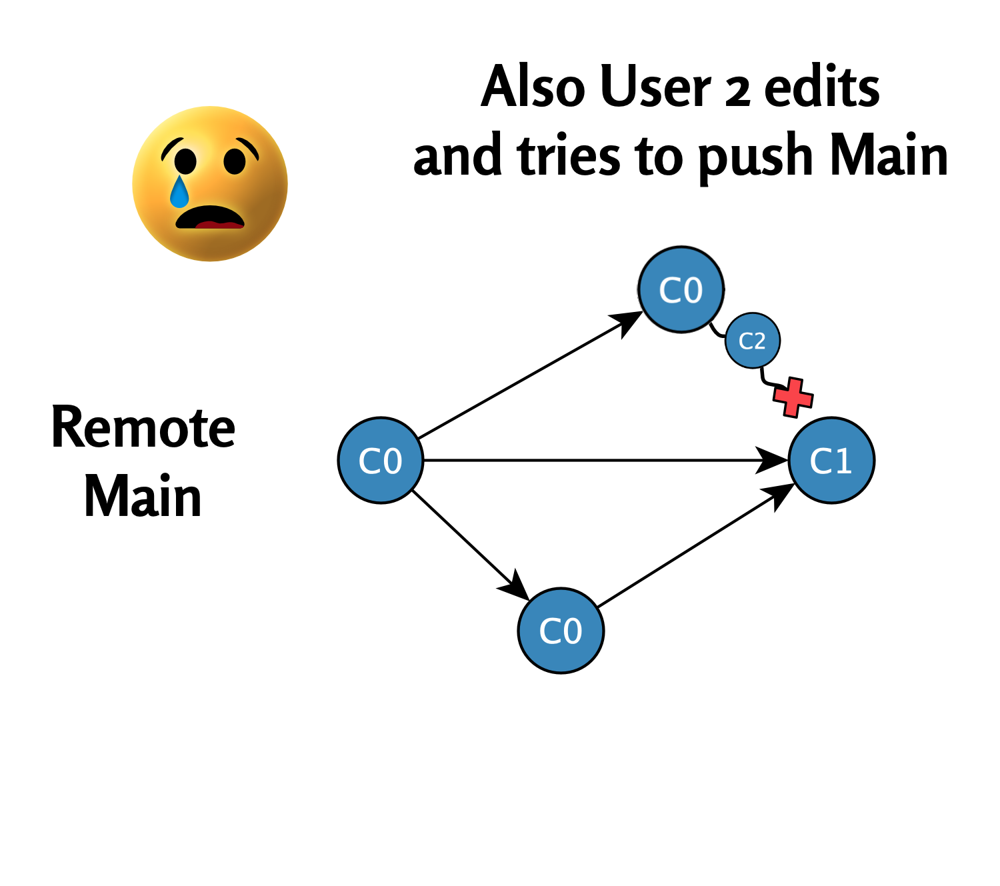

# Korjausmetodi 2: *git reset*{#method-two}

<br><br> 

<figcaption style="font-size: 0.9em; color: gray; margin-top: 5px;">

Image credit: <a href="https://www.pexels.com/photo/road-landscape-art-street-2777776/" target="_blank">Pexels</a>

</figcaption>

<br><br>

Kun käyttäjä yrittää tehdä muutoksia, mutta etähakemistossa oleva päähaara on edennyt samanaikaisesti, Git-haarojen divergoituminen voi estää työn sujuvan etenemisen. Yksi tapa ratkaista tällaisia tilanteita on käyttää **reset-menetelmää**. Tässä luvussa esittelemme tästä esimerkin.

## Alkutilanne{#alkutilanne}

Alkutilanne on vastaava kuin edellä osiossa \@ref(pull-without-merge).

-   Käyttäjät 1 ja 2 ovat tällä kertaa muokanneet tiedostoa `test2.R`.

-   Käyttäjä 1 on jo suorittanut commit- ja push -toiminnot, joten etähakemistossa päähaara on jo edennyt commit-tilaan `C1`. (Ks. Kuva alla.)

\

```{r, fig.show='hold', echo=FALSE, out.width=c('44%','10%','44%'), fig.margin = TRUE}


knitr::include_graphics("images/empty_panel_space.png")
knitr::include_graphics("images/SCR-20250111-bhtb.png")

```

**Kuva**. Tiedoston `test2.R` versiot etähakemistossa (vasemmalla) ja Käyttäjän 2 tietokoneella (oikealla) eroavat toisistaan.

\

-   Kun käyttäjä 2 nyt yrittää suorittaa **pull-komennon**, Git estää tämän, koska paikallinen haara on commit-pisteen C0 edellä.

\

Tilanne esitetään seuraavassa kaaviossa:

\

{width="451"}

## Reset-käsky

Käyttäjä 2 voi ratkaista tilanteen seuraavilla askelilla:

1.  **Ensin ongelmallinen tiedosto varmuuskopioidaan**

    Käyttäjä 2 kopioi tiedoston `test.R` työpöydälleen tai muuhun varmuuskopiointikansioon. Tämä estää tiedoston häviämisen, kun Gitin tila päivitetään.

Alla video tästä. Huom! Jos työpöydälle siirrettävä tiedosto on auki RStudiossa, tämä varoittaa tiedoston siirtymisestä:

\


**Video**. Ongelmallinen tiedosto `test2.R` varmuuskopioidaan työpöydälle.

\

\

2.  **Resetoidaan aikapiste etähakemiston viimeisimpään päähaaran aikapisteeseen**

    Käyttäjä suorittaa seuraavat komennot palatakseen etähakemiston viimeisimpään tilaan (`C1`):

\

```{bash, eval = FALSE}
git fetch
git reset --hard origin/main

```

\

Näillä komennoilla varmistetaan, että:

1. Paikallinen hakemisto vastaa etähakemiston viimeisintä tilaa
  - `git fetch` lataa uusimmat muutokset etähakemistosta ilman, että paikalliset tiedostot muuttuvat
2. `git reset --hard origin/main` palauttaa paikallisen haaran ja työtilan tarkalleen etähakemiston tilaan.


\


**Video**. Reset-käsky.

\

\

3.  **`test2.R`-tiedoston tarkastelu**

    Avaamalla `test2.R`-tiedoston Käyttäjä 2 voi havaita, että tiedosto on palautunut Käyttäjä 1:n muokkaamaan commit-tilaan `C1`:

\


**Video**. `test2.R`-tiedoston tarkastelu.

\

\

4.  **Käyttäjä 2:n muokkaaman `test2.R`-tiedoston palautus**

    Käyttäjä 2:n muokkaama `test2.R`-tiedosto voidaan nyt palauttaa työpöydältä paikalliseen Git-hakemistoon. Samalla se uudelleennimetään muotoon `test2 copy.R`:

\


**Video**. Tiedoston `test2.R` palautus työpöydältä.

\

\

5.  **Tiedostojen `test2.R` ja `test2 copy.R` tarkastelu**

    Käyttäjä 2 voi nyt vielä tarkastella edellä mainittujen tiedostojen eroja RStudiossa:

\


**Video**. Tiedostojen `test2.R` ja `test2 copy.R` tarkastelu RStudiossa.

\

\

6.  **Commit- ja push -toiminto etähakemistoon**

\

Käyttäjä 2 voi nyt halutessaan suorittaa commit- ja push -toiminnon tiedostolle `test2 copy.R`:

\


**Video**. Onnistunut commit- ja push -toiminto.

\

\

7.  **Etähakemiston tarkastelu GitHubissa**

\

Käyttäjä 2 voi nyt varmistaa, että myös hänen muokkaamansa tiedosto `test2 copy.R` näkyy etähakemistossa:

\


**Video**. Myös tiedosto `test2 copy.R` näkyy nyt etähakemistossa.

\

## Yhteenveto

Reset-metodi tarjoaa suoraviivaisen ja tehokkaan tavan ratkaista tilanteita, joissa paikallinen haara ja etähakemisto ovat divergoituneet. Tärkeimmät vaiheet sisältävät ongelmallisen tiedoston varmuuskopioinnin, reset-käskyn käytön etähakemiston tilaan palaamiseksi ja lopuksi tiedoston palauttamisen uudella nimellä. Näin käyttäjät voivat jatkaa työskentelyä ilman tietojen menetystä, ja commit- ja push-toiminnot onnistuvat jälleen.

Reset-metodin avulla vältetään monimutkaisempien konfliktien selvittäminen ja säilytetään sekä oma työ että tiimin päähaaran eheys.

\

------------------------------------------------------------------------

Divergent Git branches - ongelmasta ratkaisuun © 2025 by\
Ville Langén is licensed under the [CC BY-SA 4.0](https://creativecommons.org/licenses/by-sa/4.0/?ref=chooser-v1).

[](https://creativecommons.org/licenses/by-sa/4.0/)
